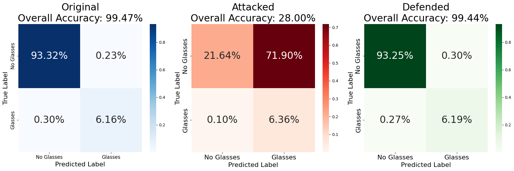
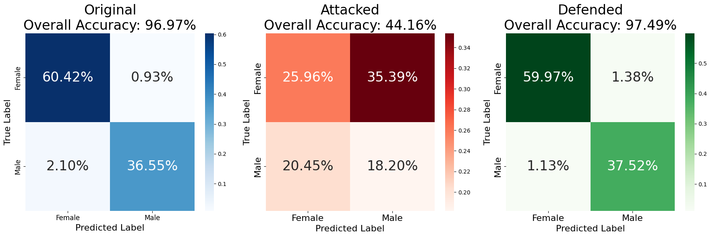
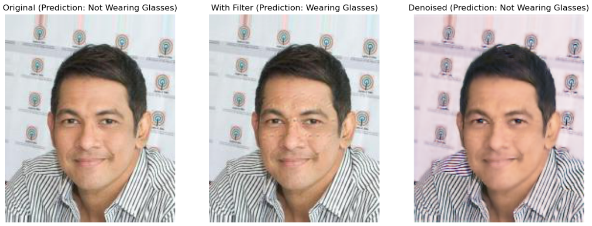
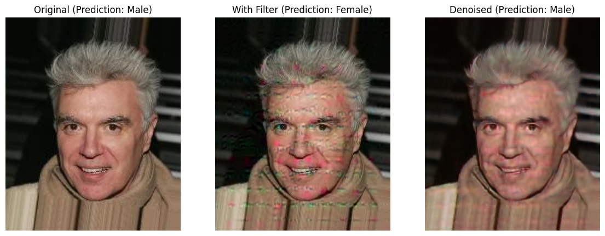

# face-filter-attack
### Universal Adversarial Perturbations & Defenses on Binary Image Classifiers

---

## What this project does

We generate an invisible noise filter — a Universal Adversarial Perturbation (UAP) — that fools a facial-attribute classifier into misclassifying nearly every image it sees. We then train a second network that detects and removes the filter, restoring accuracy to near-original levels. All of this is done on a **binary** classifier, extending attack and defense methods that were previously only demonstrated on multi-class problems.

**Tech stack:** PyTorch · ResNet-50 · CelebA · DeepFool · encoder-decoder denoiser

---

## Key findings

- **The attack is highly effective.** A single noise pattern (optimized once, applied to any image) drops eyeglasses classification from **99.47% → 28%** and gender classification from **96.97% → 44%** — without being visible to the human eye.
- **The defense fully recovers it.** A lightweight denoiser restores both attributes to within **0.5% of the original accuracy**, with no retraining of the backbone classifier.
- **Binary classifiers are just as vulnerable as categorical ones.** Prior UAP literature targeted classifiers with hundreds of classes. We show the same methods transfer directly to binary heads.
- **Localized features are easier to attack.** The eyeglasses filter (ξ = 2) breaks the classifier harder than the gender filter (ξ = 10), because glasses occupy a fixed spatial region — the learned noise concentrates exactly there (see filter visualization below).
- **Collateral damage is real but fixable.** The glasses UAP also degrades unrelated attributes (e.g. Young: −30%, Attractive: −28%). The PRN defense restores those too, recovering average accuracy across all 40 attributes from **78.49% → 88.61%**.

---

## Results

### Eyeglasses attribute (ξ = 2)

| | Accuracy |
|---|---|
| Clean baseline | 99.47% |
| Under UAP attack | 28.00% |
| After PRN defense | **99.44%** |



### Gender (Male) attribute (ξ = 10)

| | Accuracy |
|---|---|
| Clean baseline | 96.97% |
| Under UAP attack | 44.16% |
| After PRN defense | **97.49%** |



### Collateral damage of the eyeglasses attack

The UAP is targeted, but its effect leaks into correlated attributes. The PRN defense restores these as well.

| Attribute | Original (%) | Attacked (%) | Drop (%) |
|---|---|---|---|
| Eyeglasses | 99.36 | 28.71 | **−70.65** |
| Young | 85.93 | 56.03 | −29.90 |
| Attractive | 78.72 | 50.96 | −27.76 |
| Heavy Makeup | 90.69 | 73.63 | −17.06 |
| Wearing Lipstick | 91.75 | 82.23 | −9.52 |

Average accuracy across all non-eyeglasses features: **89.67% → 78.49%** under attack, restored to **88.61%** after defense.

<details>
<summary>Baseline accuracy across all 40 attributes</summary>

| Attribute | Accuracy (%) | Attribute | Accuracy (%) | Attribute | Accuracy (%) |
|---|---|---|---|---|---|
| Eyeglasses | 99.47 | Wearing Hat | 98.59 | Bald | 98.51 |
| Gray Hair | 97.33 | Sideburns | 97.26 | Male | 96.97 |
| Goatee | 96.91 | Mustache | 96.77 | Pale Skin | 96.10 |
| Double Chin | 96.08 | Wearing Necktie | 95.99 | Blurry | 95.79 |
| No Beard | 95.50 | Bangs | 95.36 | Chubby | 95.35 |
| Blond Hair | 95.13 | Rosy Cheeks | 94.56 | Wearing Lipstick | 93.56 |
| 5 o'Clock Shadow | 93.45 | Mouth Slightly Open | 92.82 | Receding Hairline | 92.15 |
| Smiling | 91.86 | Bushy Eyebrows | 90.91 | Heavy Makeup | 89.56 |
| Wearing Earrings | 89.19 | Wearing Necklace | 86.52 | Young | 86.48 |
| Brown Hair | 86.13 | Narrow Eyes | 85.95 | High Cheekbones | 85.01 |
| Black Hair | 84.97 | Bags Under Eyes | 83.97 | Big Nose | 82.90 |
| Straight Hair | 81.22 | Arched Eyebrows | 80.94 | Wavy Hair | 80.25 |
| Attractive | 80.05 | Pointy Nose | 74.39 | Oval Face | 72.93 |
| Big Lips | 69.85 | | | | |

</details>

---

## Visualizations

### The adversarial filter (amplified)

The UAP noise is imperceptible at its true scale (range: [−0.2488, 0.1208]). When amplified, faint structures concentrated around the eye region are visible — the attack has learned *where* glasses appear.

<p align="center">
  
</p>

### Sample images — Eyeglasses attack



The filter is invisible to the eye yet flips the prediction from *Not Wearing Glasses* to *Wearing Glasses*. After the PRN defense the prediction is correctly restored. A slight purple hue shift is a known artifact of the MSE loss (perception-distortion trade-off).

### Sample images — Gender attack



The gender filter is more visually disruptive (higher ξ = 10 was needed to overcome a more robust classifier), yet the defense cleanly restores both the visual appearance and the correct prediction.

---

## Architecture

```
face-filter-attack/
│
├── assets/                     ← result figures (committed to repo)
├── face-attribute-prediction/  ← upstream ResNet-50 repo (cloned separately)
├── network_init.py             ← model loading, dataloaders, CelebA prep
├── train_attack.py             ← batched DeepFool + UAP training loop
├── train_defense.py            ← PRN architecture + defense training loop
├── main.py                     ← CLI entry point (all stages)
├── visualization.ipynb         ← confusion matrices, sample images, filter display
└── requirements.txt
```

### Attack — Universal Adversarial Perturbation

We adapt the UAP algorithm of [Moosavi-Dezfooli et al. (CVPR 2017)](https://arxiv.org/abs/1610.08401) to a targeted binary setting using a batched implementation of **DeepFool**:

1. Apply the current cumulative noise δ to the batch.
2. For each image not yet fooled, compute the minimal perturbation that flips its binary prediction.
3. Average the batch perturbations and add them to δ.
4. Project δ onto the L2 ball: **‖δ‖₂ ≤ ξ**.

### Defense — Perturbation Rectifying Network (PRN)

Based on [Akhtar et al. (CVPR 2018)](https://arxiv.org/abs/1711.05929), the PRN is a lightweight denoiser inspired by the **U-Net** architecture: an encoder-decoder with a skip connection that preserves low-level spatial detail across the bottleneck.

```
Input (3×H×W)
  → Conv(3→64) → Conv(64→64) → MaxPool          [skip saved here]
  → Conv(64→128) → Conv(128→128)
  → Upsample → Cat(skip) → Conv(192→64) → Conv(64→3) → Sigmoid
```

**Loss function:**

```
L = MSE(rectified, clean) + 0.1 × CrossEntropy(classifier(rectified), true_label)
```

The MSE term enforces pixel-level fidelity; the classification term ensures semantic correctness.

---

## Quickstart

### 1. Clone repos and install dependencies

```bash
git clone https://github.com/<your-username>/face-filter-attack.git
cd face-filter-attack

git clone https://github.com/d-li14/face-attribute-prediction.git

pip install -r requirements.txt
```

### 2. Download CelebA

Download the dataset from [Kaggle](https://www.kaggle.com/datasets/kushsheth/face-vae) and place it at:

```
face-attribute-prediction/data/celeba/
    img_align_celeba/img_align_celeba/   ← images
    list_attr_celeba.csv
    list_eval_partition.csv
```

### 3. Run the full pipeline

```bash
# Run everything end-to-end for the gender attribute
python main.py --all --target male

# Or run stages individually
python main.py prepare
python main.py train   --train-epochs 10
python main.py attack  --target glasses --epochs 5 --xi 2
python main.py defense --target glasses --epochs 5
python main.py evaluate --target glasses
```

### 4. Visualize results

Open `visualization.ipynb` in Jupyter after training is complete.

---

## CLI Reference

```
python main.py [stage] [options]

Stages:
  prepare     Generate CelebA split list files
  train       Train the ResNet-50 backbone (10 epochs)
  attack      Generate the targeted UAP noise
  defense     Train the PRN denoiser
  evaluate    Print per-attribute accuracy table on the test set

Options:
  --target {glasses,male}   Attribute to attack/defend (default: male)
  --all                     Run all stages sequentially
  --xi FLOAT                L2 norm budget for UAP (default: 2 for glasses, 10 for male)
  --attack-epochs INT       UAP training epochs (default: 5)
  --defense-epochs INT      PRN training epochs (default: 5)
  --attack-batch INT        Batch size for UAP generation (default: 64)
  --max-iter INT            DeepFool iterations per batch (default: 50)
  --overshoot FLOAT         DeepFool overshoot coefficient (default: 0.02)
```

---

## References

1. Akhtar, N., Liu, J., & Mian, A. (2018). Defense against universal adversarial perturbations. *CVPR*.
2. Blau, Y., & Michaeli, T. (2018). The perception-distortion tradeoff. *CVPR*.
3. d-li14. face-attribute-prediction. [GitHub](https://github.com/d-li14/face-attribute-prediction).
4. Liu, Z., et al. (2015). Deep learning face attributes in the wild. *ICCV*.
5. Moosavi-Dezfooli, S. M., et al. (2017). Universal adversarial perturbations. *CVPR*.
6. Zhao, H., et al. (2016). Loss functions for image restoration with neural networks. *IEEE Transactions on Computational Imaging*.

---

## License

MIT
